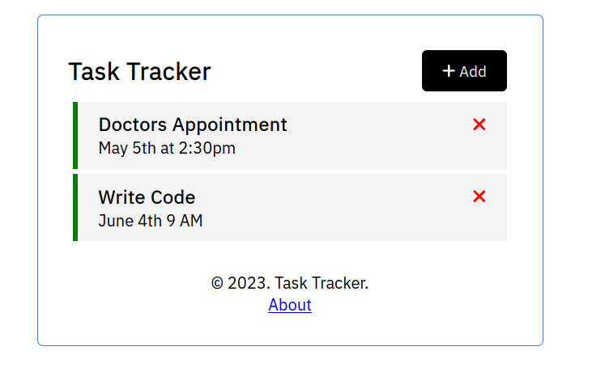

# Task Tracker

A simple application demonstrating basic functionalities of Angular along with dummy JSON Server.

How to run?

- Frontend: `ng serve`
- Dummy Backend: `npm run server`

Based on this [Tutorial](https://www.youtube.com/watch?v=3dHNOWTI7H8) by Traversy Media

